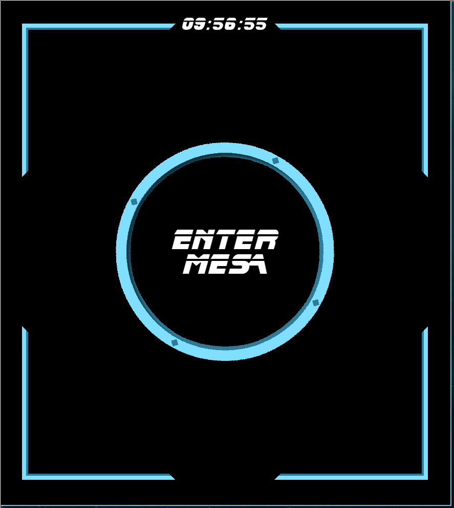
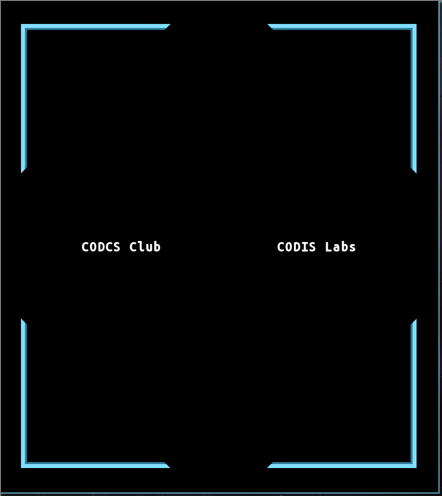
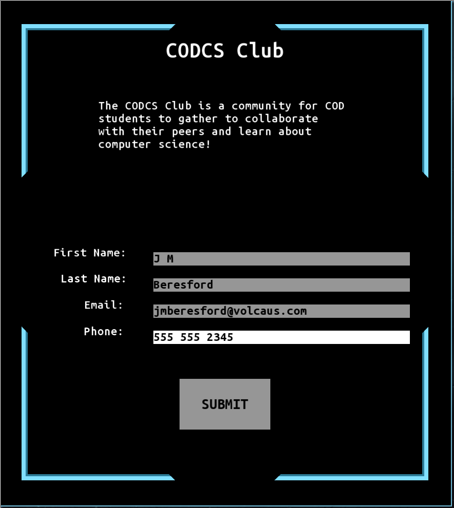

# The software for a "Smart Mirror" desinged as a means to sign up for the Computer Science Club and other STEM related clubs in the MESA lab at College of the Desert
 
### Technologies and materials used:
 - Raspberry Pi
 - C++
 - SFML
 - Nholmann's JSON for Modern C++ : https://github.com/nlohmann/json
 
### The ultimate goal is to allow for any club tied to STEM majors to add their club to the list on the mirror through our web app (WIP) which will also provide an interface for managing members and member information

### Operation of the mirror
You are intially met with a landing page:  
  
  
You enter to find a list of available clubs to sign up for:  
  
  
Upon choosing, you are directed to a sign up form:  

#### Current Roadmap:
 - Basic Functionality and UI: 99%
 - Web App: ~10%
   - UI: 0%
   - Backend: 0%
   - Hosting: 25%
 - To do
   - Additional Features and QOL changes:
    - Validation of new member information (valid email etc)
    - New Font
    - Cancel button on sign up form
    - Additional keybinds etc
    - UI Customization
    - Administration interface (per club)
